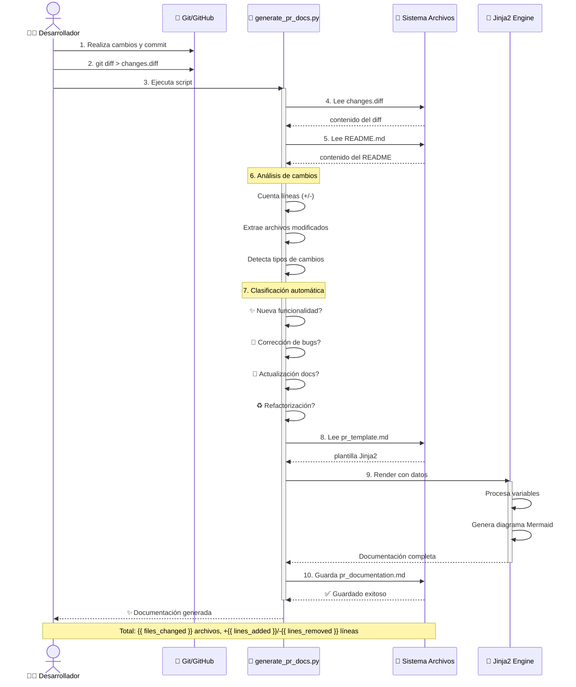

## 📊 PR Summary

Este Pull Request incluye {{ summary_description }}.

**Estadísticas:**

- 📁 Archivos modificados: {{ files_changed }}
- ➕ Líneas agregadas: {{ lines_added }}
- ➖ Líneas eliminadas: {{ lines_removed }}

## 🔄 Changes



- {{ change }}
  

## 📈 Diagrama de Secuencia del Flujo

## 📝 Impact

Este cambio mejora la calidad y funcionalidad del proyecto. Se recomienda revisar los cambios antes de aprobar el merge.


**✨ Características nuevas:** Este PR introduce nuevas funcionalidades al proyecto.



**🐛 Correcciones:** Se han solucionado errores o problemas existentes.



**📚 Documentación:** La documentación ha sido actualizada o mejorada.



**♻️ Refactorización:** El código ha sido optimizado o reestructurado.


## ✅ Next Steps

- Revisar los cambios en detalle
- Ejecutar pruebas si están disponibles
- Verificar que la documentación esté actualizada
- Validar el diagrama de secuencia refleja el flujo correcto
